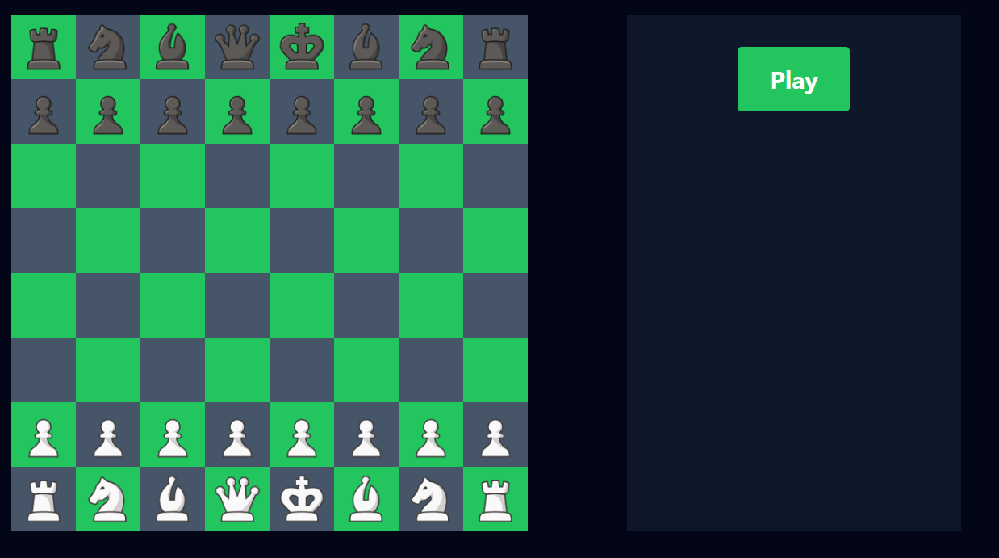

# Realtime Chess Application

This project is a realtime multiplayer chess application developed using TypeScript, React, WebSockets, and Chess.js. The application allows users to play chess games against each other in real-time with a responsive and interactive interface.

## Screenshot



## Features

- **Realtime Gameplay**: Play chess games in real-time with smooth and responsive gameplay.
- **Modern UI**: Developed with React for a dynamic and intuitive user interface.
- **Efficient Communication**: Utilizes WebSockets for real-time gameplay.
- **Robust Logic**: Chess game logic implemented using Chess.js.

## Setup

Follow these steps to set up the project on your local machine:

1. **Clone the Repository**:
    ```sh
    git clone https://github.com/Aditya-Shandilya1182/Chess
    ```
2. **Navigate to the Backend Directory**:
    ```sh
    cd Chess/backend
    ```
3. **Install dependencies**:
    ```sh
    npm i
    ```
4. **Compile TypeScript**:
    ```sh
    tsc -b
    ```
5. **Start the Backend Server**:
    ```sh
    node dist/index.js
    ```
6. **Navigate to the Frontend Directory**:
    ```sh
    cd ../../frontend
    ```
7. **Start the Frontend Development Server**:
    ```sh
    npm run dev
    ```
8. **Go to http://localhost:5173/ and enjoy!**

## Contributing

We welcome contributions to enhance the application. Feel free to submit issues or pull requests. 


---

Thank you for checking out the Realtime Chess Application!

This app is developed for educational purposes only.
